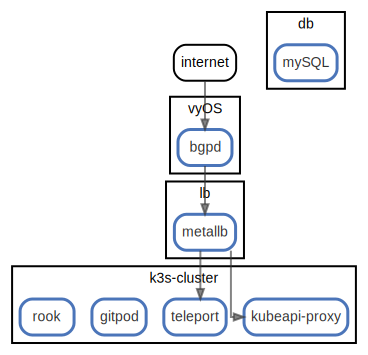

# takutaka testbed

  [ <a href="../../ndiag.descriptions/_index.md">:pencil2: Edit description</a> ]

## Nodes

| Name | Description |
| --- | --- |
| [k3s-cluster](node-k3s-cluster.md) | <a href="../../ndiag.descriptions/_node-k3s-cluster.md">:pencil2:</a> |
| [db](node-db.md) | <a href="../../ndiag.descriptions/_node-db.md">:pencil2:</a> |
| [vyOS](node-vyos.md) | <a href="../../ndiag.descriptions/_node-vyos.md">:pencil2:</a> |
| [lb](node-lb.md) | <a href="../../ndiag.descriptions/_node-lb.md">:pencil2:</a> |

## Layers

| Name | Description |
| --- | --- |

## Labels

| Name | Description |
| --- | --- |

---

> Generated by [ndiag](https://github.com/k1LoW/ndiag)
