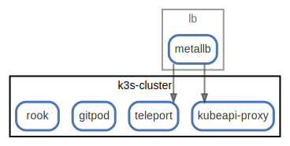

# k3s-cluster

  [ <a href="../../ndiag.descriptions/_node-k3s-cluster.md">:pencil2: Edit description</a> ]

## Components

| Name | Description | From (Relation) | To (Relation) |
| --- | --- | --- | --- |
| k3s-cluster:kubeapi-proxy |  <a href="../../ndiag.descriptions/_component-k3s-cluster_kubeapi-proxy.md">:pencil2:</a> | [lb:metallb](node-lb.md) |  |
| k3s-cluster:teleport |  <a href="../../ndiag.descriptions/_component-k3s-cluster_teleport.md">:pencil2:</a> | [lb:metallb](node-lb.md) |  |
| k3s-cluster:gitpod |  <a href="../../ndiag.descriptions/_component-k3s-cluster_gitpod.md">:pencil2:</a> |  |  |
| k3s-cluster:rook |  <a href="../../ndiag.descriptions/_component-k3s-cluster_rook.md">:pencil2:</a> |  |  |

## Labels

| Name | Description |
| --- | --- |

---

> Generated by [ndiag](https://github.com/k1LoW/ndiag)
