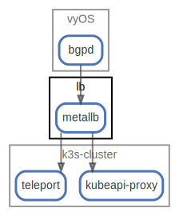

# lb

  [ <a href="../../ndiag.descriptions/_node-lb.md">:pencil2: Edit description</a> ]

## Components

| Name | Description | From (Relation) | To (Relation) |
| --- | --- | --- | --- |
| lb:metallb |  <a href="../../ndiag.descriptions/_component-lb_metallb.md">:pencil2:</a> | [vyos:bgpd](node-vyos.md) | [k3s-cluster:kubeapi-proxy](node-k3s-cluster.md) / [k3s-cluster:teleport](node-k3s-cluster.md) |

## Labels

| Name | Description |
| --- | --- |

---

> Generated by [ndiag](https://github.com/k1LoW/ndiag)
